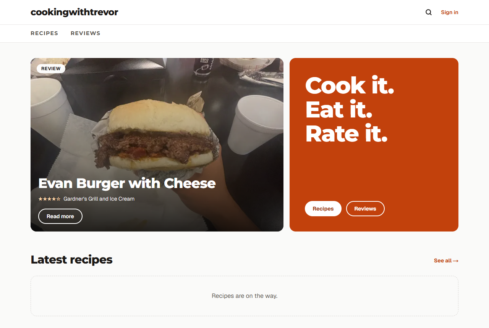
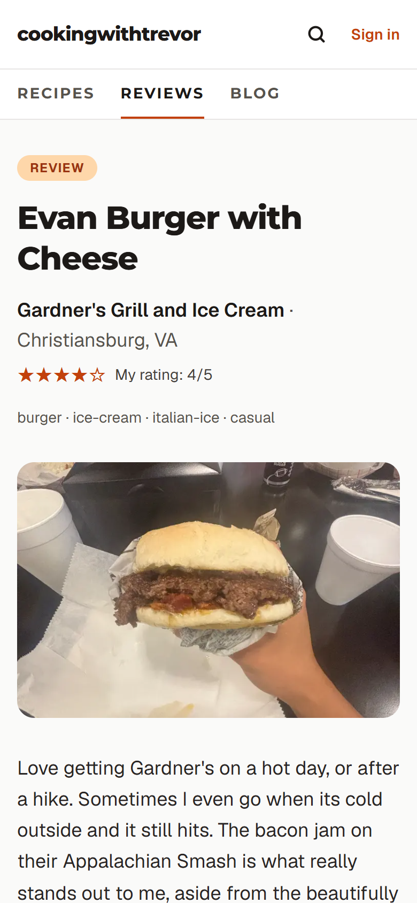
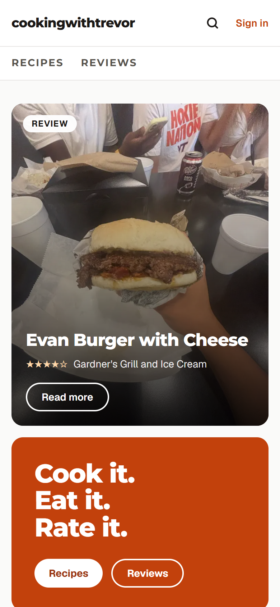
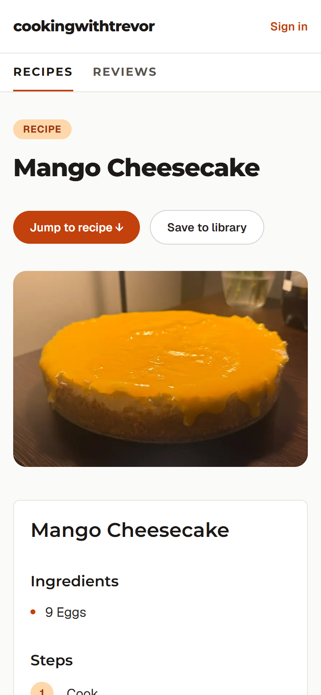

# cookingwithtrevor

**A food blog for recipes, restaurant reviews and stories, with a personal recipe library, collections and grocery lists that combine ingredients across recipes.**

**Live site:** [cookingwithtrevor.vercel.app](https://cookingwithtrevor.vercel.app)

<p>
  
  
</p>

Built solo with Next.js 16, Supabase and Tailwind CSS. Scope, decisions and trade-offs are documented in [PRD.md](PRD.md) and [DECISIONS.md](DECISIONS.md) (75+ logged decisions, each with the alternative considered).

---

## What it does

**For readers**
- Recipe posts with a **Jump to recipe** button, ingredients, numbered steps, times and servings
- **Serving scaler:** change the servings and every amount updates ("2 eggs" becomes "1 egg" at half)
- **Cook mode:** one step at a time in big text, an ingredient checklist, and the screen kept awake
- **Print** just the recipe card, and **share** a post (phone share sheet, copy link, or Pin it)
- **Food reviews** of restaurants and dishes, with the place, location and a 1–5 star rating
- **Blog posts** for stories and tips, with headings and lists
- **Star ratings and comments** on recipes and reviews, with an average shown on the post
- **Search** across recipes (including ingredients), reviews and blog posts; **tag pages** (`/tags/dessert`) and **"More like this"** under each post

**For signed-in home cooks**
- **Save** any recipe to a personal library with one click, add **private notes**, and **search** by name or tag
- Group library recipes into **collections** ("Weeknight dinners")
- Add your own **private recipes**, including photos that only you can see, or **import one from a link**: the recipe data the page publishes for Google fills in the form, you check it and save, and your copy links back to the original
- **Grocery lists:** pick several recipes and get one combined list. Matching items are merged (2 eggs + 3 eggs = 5 eggs, "2 cloves garlic, minced" + "1 clove garlic" = 3 cloves), different units stay separate, and items are **grouped by store section** (Produce, Dairy & eggs, Pantry…). Tick items off on your phone in the store.
- **Install it like an app;** grocery lists you've opened **work offline**, and ticks made without signal save when you're back online
- An **account page** to change your name or password, or delete your account and everything in it

**For the author**
- A dashboard to write, edit, publish and unpublish recipes, reviews and blog posts, without touching code
- **Two-factor authentication** for the admin, a **moderation queue** for held comments, and an **append-only audit log**
- **Phone photo uploads:** take a photo in the form; it's resized on the device and its GPS/EXIF data is stripped before upload
- **Photo galleries:** up to 12 extra captioned photos per post, shown in a grid
- Delete any comment directly on the post

<p>
  
  
</p>

## Tech stack

| | |
| --- | --- |
| Framework | **Next.js 16** (App Router, Server Components, Server Actions, Proxy), **TypeScript** |
| Database, auth, storage | **Supabase**: Postgres with row-level security, email/password auth, Storage |
| Styling | **Tailwind CSS 4**, theme tokens, Montserrat + Geist via `next/font` |
| Validation | **zod** |
| Testing | **Vitest** (281 tests) |
| Hosting | **Vercel** (auto-deploys from `main`) |
| Email | Supabase Auth over Gmail SMTP |

## Engineering highlights

- **Security in the database, not just the UI.** Row-level security on every table: users only see their own library, private recipes, notes and grocery lists. Only admins can publish; users can't change their own role (column-level grants). Admin status comes from a private email allow-list that the site's API can't read.
- **Private photos stay private.** Library photos live in a private storage bucket where each user can only touch their own folder. They're displayed through one-hour signed URLs and kept out of the shared image cache.
- **Atomic writes.** Saving a post (recipe + ingredients + steps) and creating a grocery list each run in one Postgres transaction via RPC, under the caller's permissions.
- **Fast, cached public pages.** Posts are pre-rendered and revalidated when saved (plus a 60-second fallback). Who's signed in is read in the browser, so public pages stay static.
- **Ingredient parser.** Turns "1½ Tablespoons olive oil" into `{ quantity: 1.5, unit: "tbsp", name: "olive oil" }`, normalising units so grocery lists can merge reliably. Ranges like "2-3 sprigs" are kept as written so they're never merged wrongly.
- **Spam protection.** One rating per person per post, a database-level rate limit on new accounts, and length limits.
- **SEO.** schema.org `Recipe`, `Review` and `BlogPosting` data, a sitemap, robots.txt, canonical URLs and generated meta descriptions.
- **Search without a search service.** One parameterized Postgres function does full-text + substring search over titles, write-ups, places, tags and ingredients, under row-level security.
- **Safe recipe import.** Fetching a user-supplied URL is guarded against server-side request forgery: http(s) on default ports only, every address the host resolves to must be public (private, loopback, link-local and cloud-metadata ranges are refused, IPv4 and IPv6), each redirect is re-checked, with a timeout and a size cap. Sites that turn away bots get a clear message, not a workaround.
- **Offline without a framework.** An 80-line service worker keeps the last copy of each grocery list and Next's hashed build files, and nothing else; queued ticks live in the browser until the connection returns, and saved lists are wiped whenever no one is signed in.

## Quality

**Lighthouse (mobile, live site):**

| Page | Performance | Accessibility | Best Practices | SEO |
| --- | --- | --- | --- | --- |
| Home | 97 | 100 | 100 | 100 |
| Recipe post | 98 | 100 | 100 | 100 |
| Review post | 98 | 100 | 100 | 100 |
| Reviews section | 98 | 100 | 100 | 100 |

**Accessibility:** WCAG AA colour contrast (checked for every colour pair), a skip link, labelled form fields and landmarks, keyboard-operable star pickers and checklists, and layouts tested down to 320px wide.

**Tests:** `npm test` runs 281 Vitest tests:
- **Unit tests:** ingredient parsing and formatting, grocery merge rules, store sections, the serving scaler, tags and related posts, share links, slugs, the open-redirect guard on login, site-URL handling, which URLs analytics may report.
- **Flow tests:** the real Server Actions for sign-up, creating recipes, reviews and blog posts, recipe import (parsing real-world JSON-LD shapes, and the SSRF address checks), search, collections, private photos, photo galleries, grocery lists, ratings/comments, CAPTCHA checks, moderation, the audit log, admin 2FA, account deletion and photo cleanup, run against a recording fake Supabase client so they never touch a real database.

Database rules (RLS, triggers) aren't covered by automated tests yet; that needs a separate test Supabase project.

## Security

Security is enforced in **Postgres**, not just the UI, so it holds even if someone calls the Supabase API directly with a valid login.

**Accounts and admin access**
- Email/password sign-in via Supabase Auth; email confirmation required.
- **Admin = allow-listed email + two-factor authentication.** Admin status comes from a private `admin_emails` table the API can't read, granted only to confirmed emails. Every admin power goes through `is_admin()`, which also requires the session to have passed TOTP 2FA (`aal2`). The dashboard sends unverified sessions to `/mfa` to enroll or enter a code.
- Users can't change their own role, authorship or timestamps (column-level grants).
- Post-login redirects only go to same-site paths (open-redirect guard, tested).
- Password reset by email; the response is identical whether or not the account exists, so emails can't be probed. Accounts with 2FA must enter a code before changing the password.

**Data access (row-level security on every table)**

| Data | Who can read | Who can write |
| --- | --- | --- |
| Published recipes, reviews, blog posts | Everyone | Admin (with 2FA) |
| Drafts | Admin | Admin |
| Private library recipes, notes, grocery lists, collections | Owner only | Owner only |
| Comments | Approved: everyone. Pending/rejected: author + admin | Author (stars and text only); admin can delete or moderate |
| Audit log | Admin (with 2FA) | Nobody directly (see below) |
| Blog photos | Everyone | Admin |
| Private recipe photos | Owner, via 1-hour signed links | Owner, own folder only |

**Comments and spam**
- One rating per person per post; a database rate limit on new accounts; length limits.
- Optional **Cloudflare Turnstile** CAPTCHA on sign-up, sign-in, password reset and comments (see [Optional services](#optional-services)).
- **Moderation queue:** a database trigger holds comments with links, domains, email addresses or spam words as *pending*. Users can't set the status, pending comments aren't shown or counted, and the admin approves or rejects them at `/admin/moderation`.
- All user text is rendered as plain text by React (never as HTML); blog posts use a tiny text format instead of HTML or Markdown; structured data escapes `<`.

**Audit log**
- An append-only `audit_log` table records publishing, edits, deletes and moderation decisions, with who did it and when.
- Append-only in the database: no write policies for API users, a trigger rejects every `UPDATE`/`DELETE` (even from the table owner), and `TRUNCATE` is revoked. Blog changes and moderation are logged by the database itself; recipe/review actions are logged by the app through an admin-only function.

**Uploads**
- Photos are resized on the device and re-encoded, which strips EXIF data (including GPS location) before upload.
- Storage rules: blog photos are admin-only; private photos are limited to each user's own folder; images only, 5 MB max.
- Old photo files are deleted when replaced or when their post is deleted.

**Platform**
- Only the Supabase **publishable** key is used in the app; there's no service-role key in the code or on Vercel. Secrets (the SMTP password) live only in the Supabase dashboard.
- Security headers on every response: `X-Frame-Options: DENY` / `frame-ancestors 'none'`, `nosniff`, a strict referrer policy, HSTS, and a `Permissions-Policy` that disables unused features.
- Search and every other query use parameterized calls; nothing builds SQL from user input.
- Recipe import fetches only public web addresses (see Engineering highlights), at most 20 saved imports per user per hour, and never copies the source's photo.
- Account deletion is a database function that can only delete the caller (and refuses the admin), so the app never holds a key that could delete other users.
- The offline service worker is served `no-cache` with a strict `default-src 'self'` policy.

**Known gaps / next steps**
- No full Content-Security-Policy yet (it needs testing against Next.js inline scripts).
- Database rules (RLS, triggers) aren't covered by automated tests; that needs a separate test Supabase project.
- Recipe/review audit entries are written by the app, so someone with admin credentials and 2FA calling the API directly could avoid them. Blog posts and moderation are logged by the database.
- Recipe import checks a host's addresses before fetching, but DNS could in theory change between the check and the fetch (DNS rebinding). On Vercel's serverless functions there's no private network to reach, so the risk is low.

---

## Run it locally

1. `npm install`
2. Copy `.env.example` to `.env.local` and fill in your Supabase project URL and publishable key (Supabase > Project Settings > API).
3. Turn on TOTP MFA in Supabase (Authentication > Multi-Factor), then run each file in `supabase/migrations/` in order (oldest first) in the SQL Editor.
4. Put your Instagram URL and contact email in `lib/site-config.ts` (left empty, the Instagram link is hidden).
5. `npm run dev` and open http://localhost:3000

```
npm test               # run the tests once
npm run test:watch     # re-run on save
npm run lint
npm run build
npm run screenshots    # re-take the README screenshots from the live site
```

### Make yourself the admin

Add your email (lowercase) to the private admin list in the Supabase SQL Editor:

```sql
insert into public.admin_emails (email) values ('you@example.com');
```

That account becomes admin now (if it exists and is confirmed), and automatically whenever it signs in with a confirmed email, even if the account is recreated. The list can't be read through the site's API and is kept out of this repo.

The first time you open the dashboard, `/mfa` shows a QR code to scan with an authenticator app; after that it asks for a 6-digit code each session. Lost your device? Delete the factor in Supabase > Authentication > Users.

### Auth redirect URLs

In Supabase > Authentication > URL Configuration, set the Site URL to your deployed URL and add `http://localhost:3000/auth/callback` and `https://<your-domain>/auth/callback` to Redirect URLs. Sign-in is email and password only.

### Confirmation emails

Supabase's built-in email only reaches your own team's addresses, so set up custom SMTP in Supabase > Authentication > Emails > SMTP Settings. Or run `scripts/configure-auth-email.ps1` (PowerShell), which sets SMTP and both email templates below through the Supabase Management API; it prompts for a personal access token and the Gmail app password and stores neither. This project uses a dedicated Gmail account with an [app password](https://myaccount.google.com/apppasswords) (`smtp.gmail.com`, port 465); a custom domain with a service like Resend delivers better. Then, in Authentication > Emails > Confirm signup, use this link so it works in any browser or device:

```html
<a href="{{ .SiteURL }}/auth/confirm?token_hash={{ .TokenHash }}&type=email">Confirm your email</a>
```

The link opens `/auth/confirm`, where the person presses **Confirm my email**. The button step matters: university and corporate email scanners (e.g. Microsoft Safe Links) open every link in a message, which would otherwise use up the one-time link before the person clicks it.

Without custom SMTP, confirmation still works: if the link opens in a different browser, the user is told their email is confirmed and asked to sign in.

For **password resets** (Forgot your password? on the sign-in page), set Authentication > Emails > **Reset Password** to:

```html
<a href="{{ .SiteURL }}/auth/confirm?token_hash={{ .TokenHash }}&type=recovery&next=/reset-password">Reset your password</a>
```

The link opens `/auth/confirm` with a **Continue to set a new password** button (scanner-safe, as above), then `/reset-password`. Accounts with 2FA enter their code first.

### Optional services

Each of these is off until you set it up. Environment variables go in Vercel > Project > Settings > Environment Variables, followed by a redeploy; see `.env.example`.

**CAPTCHA (Cloudflare Turnstile, free).** The order matters, because once Supabase requires CAPTCHA it rejects sign-ins that don't carry a token:
1. Cloudflare dashboard > Turnstile > Add widget, for your site's domain (add `localhost` too if you want it in development).
2. In Vercel, set `NEXT_PUBLIC_TURNSTILE_SITE_KEY` (site key) and `TURNSTILE_SECRET_KEY` (secret key), and redeploy. The check now appears on the forms, and comments are verified.
3. Last, in Supabase > Authentication > Attack Protection, turn on CAPTCHA protection with Turnstile and paste the same secret key.

To turn it off, undo the steps in reverse order.

**Visitor analytics (Vercel Web Analytics).** Turn on Web Analytics in the Vercel project, then set `NEXT_PUBLIC_ANALYTICS=vercel`. It uses no cookies, reports page paths without query strings, and never counts private pages; the privacy page updates itself to mention it.

**Google Search Console.** Add a URL-prefix property for the site, choose the HTML tag method, put the `content` value in `GOOGLE_SITE_VERIFICATION`, redeploy, press Verify, then submit `sitemap.xml` under Sitemaps.

**Database backups.** `.github/workflows/backup.yml` dumps the database every night, encrypts it, and keeps it as a workflow artifact for 30 days. To turn it on, add two secrets under the GitHub repo's Settings > Secrets and variables > Actions:
- `SUPABASE_DB_URL`: Supabase > Connect > **Session pooler** connection string, with your database password in it. (GitHub's runners can't reach the direct connection, which is IPv6-only.)
- `BACKUP_PASSPHRASE`: a long random passphrase. Keep a copy in a password manager; without it the backups can't be opened.

Then run it once from Actions > Database backup > Run workflow. To restore, download the artifact, decrypt it with `gpg --decrypt cookingwithtrevor-<date>.dump.gpg > db.dump`, and load it with `pg_restore` into a **new** Supabase project (not over the live one) following Supabase's backup-and-restore guide. Try a restore once before you need one. Photos in Storage aren't included.

**Custom domain.** Add the domain in Vercel > Domains, then update everything that names the old address: `NEXT_PUBLIC_SITE_URL` in Vercel, the Site URL and Redirect URLs in Supabase > Authentication > URL Configuration, the Turnstile widget's domains, and a new Search Console property.

## Project structure

```
app/
  page.tsx               home: featured post, latest recipes and reviews
  recipes/, reviews/     section pages and post pages (cached, rebuilt on save)
  blog/                  blog index and posts
  search/                site search
  tags/                  every tag, and the posts under each one
  admin/                 dashboard: posts, blog, moderation queue, audit log
  mfa/                   admin two-factor enroll/verify
  library/               saved and private recipes, import from a link, search, notes, collections
  grocery/               grocery lists: combine recipes, grouped by store section, tick items off
  login/, auth/          email sign-in/sign-up and confirmation handlers
  account/               change name or password, delete your account
  about/, privacy/       about page and privacy policy
  comment-actions.ts     ratings and comments
  sitemap.ts, robots.ts
  manifest.ts, icons/    installable app: web app manifest and PNG icons
components/              shared UI (post page, cards, forms, photo upload, nav)
lib/                     data access, validation, ingredient parser, grocery merge, photos
lib/supabase/            Supabase clients (browser, server, public, proxy)
proxy.ts                 refreshes auth sessions; guards /library, /grocery, /account, /admin
public/sw.js             service worker: offline grocery lists
supabase/migrations/     schema, row-level security, storage policies, RPCs
tests/                   unit tests and Server Action flow tests
scripts/screenshots.mjs  README screenshots via Chrome DevTools Protocol
.github/workflows/       nightly encrypted database backup
```
